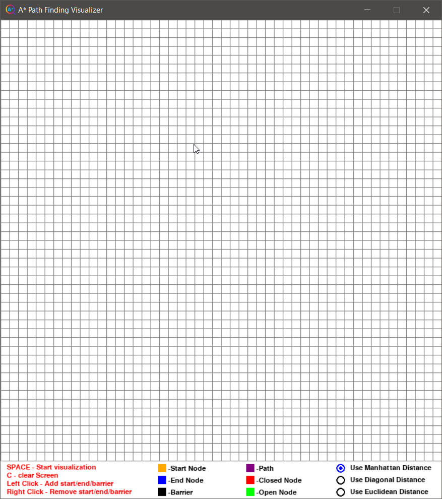
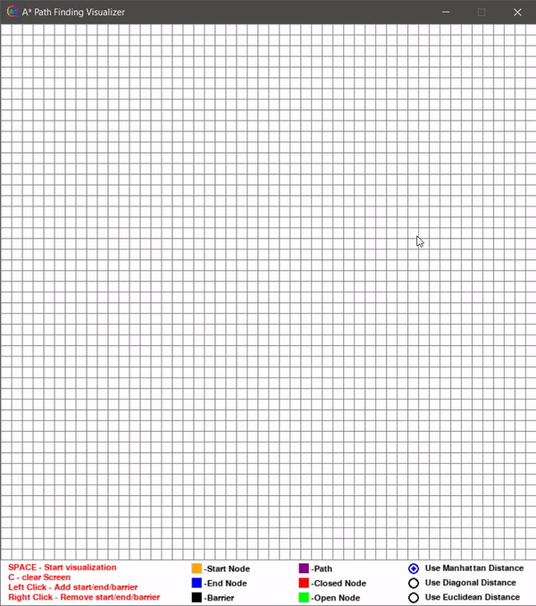
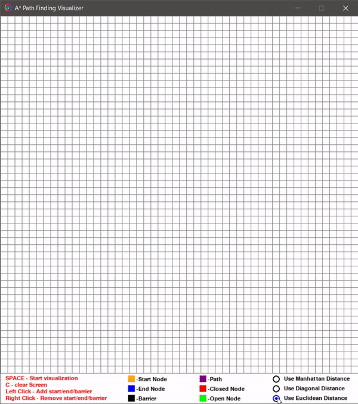
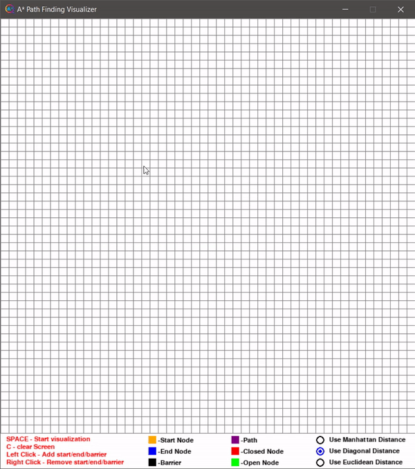

# A* Path Finding Visualizer

It is an algorithm used to find the shortest path in a graph. In real-life situations it can be used to find the shortest path in map, and can be used in games.
This is a visualizer, to understand how the A* algorithm works. It is built fully using python, game development package, pygame. 

&nbsp;

Some import Key and there functions are :-

KEY  |  FUNCTION
-----|-----------
SPACE|start Visualization
C  | Clear screen
Left Click | Add start / end / barrier
Right Click | Remove start / end / barrier


&nbsp;

The Home page look as below :-



&nbsp;

The A* algorithm is smart algorithm when compared with other path finding algorithm. It is because the algorithm starts searching in the direction where the end node is present.
This functionality of A* Path finding algorithm is acheived as the algorithm not oly tracks the weight of the path it came across, but it also tries to predict how much more distance
is there to reach the end node. This prediction distance is called Heuristic distance. There are many ways of finding this heuristic distance. Three among many can be visualized in
this visualizer.

&nbsp;

To visualize A* algorithm using different distance formula for heuristic distance, the corresponding radio button at the bottom of the visualizer can be clicked.



&nbsp;

### 1. Manhattan Distance :

It is sum of absolute values of difference in goal's X and Y coordinates and current's X and Y coordinates

```
h  = abs(current_cell.x - goal_cell.x) + abs(current_cell.y - goal_cell.y)
```

&nbsp;

The visualization of A* Algorithm using manhattan distance for heuristic distance is shown below


&nbsp;

### 2. Diagonal Distance :
It is maximum  of absolute values of differences in the goal’s x and y coordinates and the current cell’s x and y coordinates respectively

```math
dx = abs(current_cell.x – goal.x)
dy = abs(current_cell.y – goal.y)
h = D * (dx + dy) + (D2 - 2 * D) * min(dx, dy)

where D is length of each node
D2 is diagonal distance - sqrt(2 * D)
``` 

&nbsp;

The visualization of A* Algorithm using Diagonal distance for heuristic distance is shown below



### 3. Euclidean Distance :

It is the distance between the current cell and the goal cell using the distance formula

```math
 h = sqrt ( (current_cell.x – goal_cell.x)^2 + (current_cell.y – goal_cell.y)^2 )
```

&nbsp;

The visualization of A* Algorithm using Euclidean distance for heuristic distance is shown below



&nbsp;

### Limitations 
Although being the best pathfinding algorithm around, A* Search Algorithm doesn’t produce the shortest path always, as it relies heavily on heuristics / approximations to calculate – h

